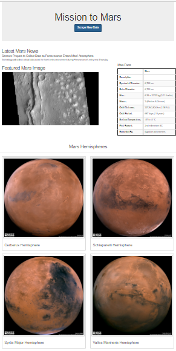

# Mission-to-Mars
Build an app to scrape websites for data pertaining to the Mission to Mars, and then create an HTML page to display the results.

## Overview of Project
**Task:** Automate a web browser to visit different websites to extract data about the Mission to Mars. 
Store retrieved data in a NoSQL database, and then render the data in a web application created with Flask. 

**Method:** Using BeautifulSoup, Splinter, MongoDB and Flask.

**The Analysis should include the following information:** 

1. Use BeautifulSoup and Splinter to scrape information about Mars and full-resolution images of Mars’s hemispheres.
2. Store the scraped data on a Mongo database.
3. Use a web application to display the data, and alter the design of the web app to accommodate these images.

## Resources
- Data Source: [https://astrogeology.usgs.gov](https://astrogeology.usgs.gov/search/results?q=hemisphere+enhanced&k1=target&v1=Mars); [https://mars.nasa.gov/news/](https://mars.nasa.gov/news/); [https://data-class-jpl-space.s3.amazonaws.com/JPL_Space/index.html'](https://data-class-jpl-space.s3.amazonaws.com/JPL_Space/index.html')
- Source Code: 
    [app.py](app.py); [scraping.py](scraping.py); [Mission_to_Mars_Challenge.ipynb](Mission_to_Mars_Challenge.ipynb); [templates/index.html](templates/index.html)
  
- Software: Python 3.7.9 64-bit (conda); jupyter-notebook : 6.1.4
- MongoDB; Flask

## Results

- **Code Example: Scrape full-resolution images of Mars’s hemispheres**

        def hemisphere_image_urls(browser):
            # Visit URL
            url = 'https://astrogeology.usgs.gov/search/results?q=hemisphere+enhanced&k1=target&v1=Mars'
            browser.visit(url)

            #Create a list to hold the images and titles.
            hemisphere_image_urls = []
            #create BeautifulSoup object and parse
            hemispheres_soup = soup(browser.html, 'html.parser')
            #get the 4 hemispheres (class of 'item')
            hemispheres = hemispheres_soup.select('div.item')

            #Add try/except for error handling
            try:
                # 3. Write code to retrieve the image urls and titles for each hemisphere. 
                for hemisphere in hemispheres:
                    title = (hemisphere.find('h3').text).replace(' Enhanced', '')
                        
                    #click the hemisphere
                    browser.click_link_by_partial_text(title)

                    #make new soup of that page
                    link_soup = soup(browser.html, 'html.parser')

                    #find the full image
                    full = link_soup.find('a', text='Sample')

                    #get the img url
                    img_url = full['href']

                    #make a dict and append to the list
                    hemisphere_image_urls.append({'title': title, 'img_url': img_url})

                    #go back 
                    browser.back() 

            except AttributeError:
                return None

            return hemisphere_image_urls

   
    **Snapshot of final webpage**

    

    